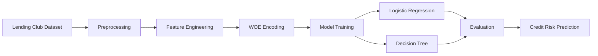

# Credit Risk Scorecard — Loan Default Prediction

> **A credit risk modeling project that builds an interpretable credit scorecard using Weight of Evidence (WOE), Information Value (IV), and machine learning to predict loan defaults on the Lending Club dataset.**

Credit risk assessment is one of the most critical applications of machine learning in finance. This project implements a traditional credit scorecard pipeline by combining statistical feature engineering techniques with predictive modeling to estimate the likelihood of loan default.

Using the Lending Club loan dataset, the project preprocesses raw loan records, transforms variables using **Weight of Evidence (WOE)** encoding, evaluates their predictive strength with **Information Value (IV)**, and compares the performance of Logistic Regression and Decision Tree models for default prediction.

---

## Features

- End-to-end credit risk modeling pipeline
- Binary loan default prediction
- Automatic feature binning
- Weight of Evidence (WOE) transformation
- Information Value (IV) analysis for feature selection
- Logistic Regression scorecard model
- Decision Tree classifier
- ROC curve and classification metric evaluation
- Interpretable feature engineering for financial applications

---

## Workflow

## Workflow



---

## Dataset

The project uses the **Lending Club Loan Dataset**, one of the most widely used datasets for credit risk modeling and loan default prediction.

**Dataset:** https://www.kaggle.com/datasets/wordsforthewise/lending-club

The dataset contains historical loan applications along with borrower attributes and repayment outcomes.

Only loans with resolved statuses are retained:

- Fully Paid
- Charged Off
- Default

A binary target variable, **Late_Loan**, is created:

| Value | Description |
|------:|-------------|
| 0 | Fully Paid |
| 1 | Charged Off / Default |

---

## Methodology

### Data Preparation

The preprocessing pipeline includes:

- Removing variables with excessive missing values
- Eliminating data leakage features
- Dropping non-predictive identifiers
- Handling missing values
- Preparing variables for binning

---

### Feature Engineering

Each predictor is transformed into statistically meaningful representations through:

- Automatic numerical binning
- Categorical binning
- Weight of Evidence (WOE) encoding
- Information Value (IV) computation

These techniques improve model interpretability while preserving predictive power, making them widely adopted in traditional credit scoring.

---

### Predictive Models

Two supervised learning models are implemented and compared.

#### Logistic Regression

A traditional scorecard model commonly used in banking and financial risk assessment due to its interpretability.

#### Decision Tree

A non-linear model capable of capturing complex relationships between borrower characteristics and default risk.

---

## Technologies Used

| Category | Technologies |
|----------|--------------|
| Programming Language | Python |
| Data Processing | Pandas, NumPy |
| Statistical Analysis | SciPy, StatsModels |
| Machine Learning | Scikit-learn |
| Visualization | Matplotlib, Seaborn |
| Development | Jupyter Notebook |

---

## Installation

Clone the repository.

```bash
git clone https://github.com/BM-6337/credit-scorecard.git

cd credit-scorecard
```

Install the required dependencies.

```bash
pip install -r requirements.txt
```

---

## Running the Project

1. Download the **Lending Club loan dataset** from Kaggle.
2. Update the dataset path in the notebook.
3. Launch Jupyter Notebook.

```bash
jupyter notebook "Credit Scorecard.ipynb"
```

Run all notebook cells sequentially to:

1. Load the dataset
2. Clean and preprocess the data
3. Perform WOE and IV analysis
4. Train predictive models
5. Evaluate model performance

---

## Project Structure

```text
credit-scorecard/
├── Credit Scorecard.ipynb     # Complete implementation
├── requirements.txt           # Project dependencies
├── README.md
└── LICENSE                 
```

---

## Model Evaluation

The trained models are evaluated using multiple performance metrics, including:

- Accuracy
- Confusion Matrix
- Precision
- Recall
- F1 Score
- ROC Curve
- Area Under the Curve (AUC)

This enables a comprehensive comparison between Logistic Regression and Decision Tree approaches for credit risk prediction.

---

## Future Improvements

- Hyperparameter optimization
- Cross-validation pipeline
- Gradient Boosting (XGBoost / LightGBM)
- Explainability with SHAP values
- Interactive dashboard for scorecard visualization
- Deployment as a REST API

---

## License

This project is licensed under the MIT License.

---

> *Building interpretable machine learning models for smarter credit risk assessment.*
